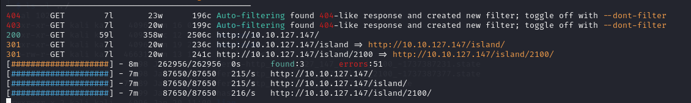

# Lian Yu

THM Room - [Lian Yu](https://tryhackme.com/r/room/lianyu)
This room feels a bit repetitive if you had previously completed others in this same difficulty level.

## Website Enumeration

- An `nmap` scan doesn’t give much aside from the ones you already expected.

```bash
nmap -sC -A <IP>
```

- The tool `feroxbuster` actually came in handy with its `--force-recursion` flag which, as far as I know, you wouldn’t find such a feature in `gobuster`.
- I was using `gobuster`in my first few rooms and now I think I might completely move on to `ferox` unless I only need directories to be enumerated.
- Sure, `gobuster` could go recursive and I didn’t know that but hey, at least I know one tool that does it.

After you do a `ferox` scan, you would get some interesting webpages to visit.

```bash
feroxbuster -u  http://<IP>/ --force-recursion -w /usr/share/wordlists/dirbuster/directory-list-2.3-small.txt
```



Those yellow URLs would be the one you’d like to go and give a visit.

Normally after visiting any webpage in CTFs, a good way to find something there is first by inspecting the source code of it and you’d capitalize off of it in this room.

Inspect both of those interesting webpages and in one of them, you will come to know that we should be looking for a file with a specific extension in the website and in the other one, you’d find something that you’d need later for FTP logins.

If you got the extension, search for that using using any one of your directory enumerator. Here’s what I used: 

```bash
feroxbuster -u  http://<URL> --force-recursion -w /usr/share/wordlists/dirbuster/directory-list-2.3-small.txt -x <EXTENSION>
```

Now that you have the path to that specific file, give it a visit and you’d find a weird word

And if you had any experience with weird words, you’d probably have a hunch that it belongs to a family of weird words. (`base`)

Head to [CybeChef](https://gchq.github.io/CyberChef/) and try out all possible variants of that family and you’d get a password that looks a little bit less weird.

Now, in the other interesting webpage, you’d get the username that’s needed so pick it up. We will be needing these to get access to the  `ftp` server.

## Gaining Access

Connect to the ftp server and enter the username and password you found up until now

```bash
ftp <IP>
```

Now that you got into the `ftp` server, try and retrieve as many files as possible. There is also one hidden file so look for it too.

You can get a file from the server to your own machine by this:

```bash
get <fileName>
```

Now, you’d have a bunch of image files and a normal file. Image files are an indicator that it potentially contains some compressed files in it. So you’d need to run `steghide` on them.

```bash
steghide extract -sf <fileName>
```

Two of those image files won’t be supported by `steghide` but given the way they are named, its safe to assume that you should do what they say. Of course, it probably won’t be true for files from other rooms.

Now, one of those image files need a passphrase to access. The `JohnTheRipper` version of steganographic files is `stegcracker` .

Give it a go and you’d get its passphrase.

```bash
stegcracker <fileName>
```

Now you have 2 more files on your hand and one of those contains another password (for `ssh`)

If you go back to the hidden file we got from the `ftp` server, it would show a username in all of its a content.

Use these two and now you have access to the machine.

- You will get the user flag right after you log into `ssh`

## Privilege Escalation

A common way to try and get to `root` is first by checking which commands can our user can run as super-user without needing the root password.

That can be done by executing:

```bash
sudo -l
```

Now that you have which utility can be run as super-user without the `root` password, head to [GTFOBins](https://gtfobins.github.io/) and search for our utility.

This website is used to escalate our privileges through common Linux utilities on misconfigured systems. Pretty useful for CTFs.

And that’s it! You now have `root` access and also the root flag.
